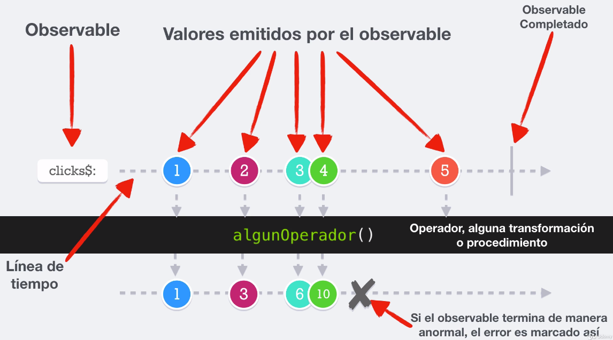

## **Sección 2: Introducción a las extensiones reactivas y a la programación reactiva**

## Tabla de contenidos
- [Sección 2: Introducción a las extensiones reactivas y a la programación reactiva](#seccin-2-introduccin-a-las-extensiones-reactivas-y-a-la-programacin-reactiva)
- [Tabla de contenidos](#tabla-de-contenidos)
    - [Introducción a la sección](#5-introduccin-a-la-seccin)
    - [6. Temas puntuales de la sección](#6-temas-puntuales-de-la-seccin)
    - [7. Conceptos generales](#7-conceptos-generales)
    - [8. ¿Qué es ReactiveX? ¿Cómo funciona?](#8-qu-es-reactivex-cmo-funciona)
    - [9. ¿Cómo leer los diagramas de canicas?](#9-cmo-leer-los-diagramas-de-canicas)
    - [10. Configuración del proyecto](#10-configuracin-del-proyecto)
    
## 5. Introducción a la sección
bases de expresiones reactivas y una breve introducción del diagrama de canicas 
## 6. Temas puntuales de la sección
En esta sección aprenderemos sobre:

* Conceptos generales de RxJs y las extensiones reactivas
* ¿Qué es ReactiveX?
* ¿Cómo funciona?
* ¿Qué es el patrón observable?
* ¿Cómo leer los diagramas de canicas?
* Y otros temas

Es una sección corta llena de teoría, pero es indispensable que lo aprendamos para poder tener un mejor panorama de la programación reactiva.

**[⬆ volver arriba](#tabla-de-contenidos)**
## 7. Conceptos generales 

**Por qué utilizar expresiones rea ctivas?**
todos queremos obtener información en tiempo real 

Imaginémonos por ejemplo ustedes están en Twitter y ustedes obviamente quieren tener los últimos tweets, exactamente en el momento que son emitidos.

Si ustedes están en alguna aplicación que trabaja con precios obviamente ustedes van a querer saber, el precio en el momento en que cambia el ambiente de videojuegos prácticamente todo podría trabajarse con extensión reactivas.

No necesariamente hablando de juegos online.

La distancia que hay de nuestro personaje contra alguna pared contra algún enemigo todo podría calcularse con base en extensiones reactivas.

Si nos vamos a un ejemplo más típico hablando sobre un chat nosotros a estas alturas del partido pensar, en hacer un refresh del navegador web para obtener la última data no es algo viable hoy en día. Si ustedes hacen un refresh de su aplicación para cargar nueva información que viene del servidor posiblemente, sus usuarios o sus operadores van a sentir que esta aplicación ya es vieja es arcaica y posiblemente, ustedes mismos consideren que esto es un problema en su desarrollo.

Nosotros vamos a querer que nuestra aplicación pueda hacer peticiones a la red y a su vez seguir haciendo, interacciones con la interfaz de usuario y que cuando se retorna a la información de una API por ejemplo, nosotros podamos actualizar la interfaz de usuario para poder mostrar cambios dinámicos en tiempo real al mismo.

Todo esto sin que la aplicación se sienta que se congela o que su rendimiento decae considerablemente.

Esto nos lleva a una pregunta muy interesante 

**Cuándo usar extensiones reactivas?**.

* Pues básicamente para manejar cualquier evento de la interfaz de usuario cuando es necesario notificar
* sobre cambios en un objeto o varios objetos cuando ustedes están trabajando con comunicación por sockets.
* Es sumamente útil y básicamente cuando necesitamos trabajar con flujos de información como por ejemplo extremes de información

hay tres piezas fundamentales que tiene la programación reactiva.

* Observables
  * en la primera en la parte de los observables es la pieza fundamental de las extensiones reactivas y básicamente es la fuente de información pueden emitir varios valores puede emitir sólo uno o no emitir absolutamente nada.
  * También pueden emitir errores pueden ser infinitos y finitos cuando son finitos ellos asimismo pueden completarse.
  * También pueden ser síncronos o asíncronos.
  - Muchas personas piensan que la programación reactiva no puede ser síncrona, pero aquí vamos a hacer varios ejemplos para demostrar que sí funciona de manera síncrona. Pero obviamente uno de sus fuertes es trabajar de manera asíncrona

* Subscribers
  * se suscriben a un observable es decir, estar pendiente de lo que realiza un observable, son los que consumen u observan la data que proviene del observable pueden recibir los errores y eventos del observable.
  * Algo muy interesante es que ellos desconocen todo lo que se encuentra detrás en el observable es decir, desconocen si la información viene filtrada viene transformada viene de alguna otra fuente. Pasó por varios lugares a ellos no les interesa.

* Operators
  * usados para **transformar** observables (map, group, scan)
  * usados para **filtrar** observables (filter, distinct, skip, debounce ... )
  * usados para **cambiar** observables
  * usados para **creat** nuevos observables
  
Ejemplo 

* 1. Rastrear la ubicación del usuario
* 2. Sólo tomas la ubicación cuando la precisión es menor a 20 mtr
* 3. También seguir la acele ración y el sensor magnético para determinar el acimut
  * norte magnetico de la tierra, para saber si el usuario estaba caminando hacia el norte ó el sur
* 4. Combinar los valores del acimut y la ubicación
* 5. Enviar cada 5 seg la información a un API
  * esta api me va permitir   notificar a la persona que lo está siguiendo o bien almacenar esta información
* 6. Con la respuesta del Api, dibujar el UI la información deseada


### Beneficios de la programación reactiva 
* Evitar el CALLBACK HELL
* Trabajar de forma simple tareas sincrónicas y asíncronas.
* Uso de operadores para reducir y simplificar el trabajo
* Es fácil transformar los flujos (streams) de la información 
* Código más limpio y fácil de leer
* Fácil de implementar
* Fácil anexar procedimientos sin alterar el producto final

**[⬆ volver arriba](#tabla-de-contenidos)**
## 8. ¿Qué es ReactiveX? ¿Cómo funciona?

### The observer pattern done right

> ReactiveX is a combination of the best ideas from the observer pattern, the Iterator pattern, and functional programming

### Observer Pattern

Es un patrón de diseño de software que define una dependencia del tipo uno a muchos entre objetos, de manera que cuando uno de los objetos cambia su estado, notifica este cambio a todos los dependientes

### Iterator Pattern
En POO, el patrón iterador define una interfaz que declara los métodos necesarios para acceder secuencialmente a un grupo de objetos de una colección

[1 ,2, 3, 4, 5, 6, 7, 8, 9]

primero() -> 1, siguiente() -> 2, hayMas() + true y elementoActual() -> 1

### Programación funcional

Es básicamente, crear un conjunto de funciones que tengan un objetivo específico. Es decir, si tengo una función que reciba "A", y retorna "A+1", siempre que yo llame esa función, retorna 'A+1'
Sin efectos secundarios y sin mutar la data 

### RESUMEN
Observer Pattern
* notifica cuando suceden cambios

Iterator Pattern
* Poder ejecutar operaciones secuenciales

Programación funcional
* Tener funciones con tareas específicas que reciban argumentos y no muten la información


**[⬆ volver arriba](#tabla-de-contenidos)**

## 9. ¿Cómo leer los diagramas de canicas?

[RxJs - firebase doc](https://rxjs-dev.firebaseapp.com/)

[RxJs - official doc](http://reactivex.io/
)



**[⬆ volver arriba](#tabla-de-contenidos)**
## 10. Configuración del proyecto

* Lo primero que debemos hacer después de descargar el código es ejecutar el comando:

```
npm install
```
Ese comando descargará todos los módulos de node necesarios para ejecutar el proyecto.


* Cuando termine de instalar los node_modules, entonces podemos ejecutar el proyecto con el siguiente comando

```
npm start
```
Para que funcione, recuerden que se debe ejecutar este comando en el mismo directorio donde se encuentra el ```package.json```

## Cambiar el puerto
Por defecto, el puerto que configuré para este proyecto es el ```8081```, pero si necesitan cambiarlo porque pueda que ese puerto lo use su computadora, pueden cambiarlo abriendo el ```package.json``` >> scripts. Ahí verán la instrucción que lanza el servidor de desarrollo

```
"start": "webpack-dev-server --mode development --open --port=8081"
```
**[⬆ volver arriba](#tabla-de-contenidos)**
