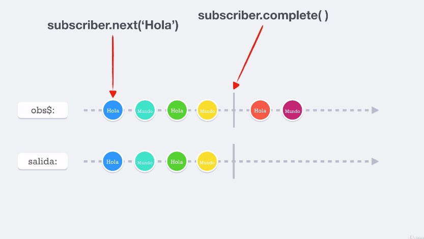

## **Sección 3: Observables**

## Tabla de contenidos
- [Sección 3: Observables](#seccin-3-observables)
- [Tabla de contenidos](#tabla-de-contenidos)
    - [12. Temas puntuales de la sección](#12-temas-puntuales-de-la-seccin)
    - [13. Nuestro primer observable](#13-nuestro-primer-observable)
    - [18. Subject](#18-subject)
    - [19. Subject - Parte 2](#19-subject---parte-2)

## 12. Temas puntuales de la sección
Estamos a las puertas de la sección que nos enseñará sobre los observables, el primer eslabón de la programación reactiva, veremos temas como:

* Observers
* Subscriber
* Unsubscribe
* Subjects
* Hot y Cold Observables
* Observables en cadena

Antes de utilizar funciones que crean observables, es importante comprender las bases para entrar a temas de la generación automática de observables.

## 13. Nuestro primer observable

¡Esté observable emite valores pero los dos últimos ya no los emite en la salida

## 18. Subject

> buscar mas en la documentació oficial

* Casteo múltiple: muchas subscripciones va a estar subject (observable), y va a servir para distribuir la misma información a todos los lugares que estén subscritos (todos los lugares que les interese ese valor)
* También es un **observer**:  en clases 14 se envio un observer como parámetro a una subscripción `obs$.subscribe(observer)`, podemos enviar un subject como argumento al _subscriber_
* Puede manejar el `NEXT, ERROR, COMPLETE`

## 19. Subject - Parte 2

> cuando la data es producida por el observable en si mismo, el considerado un **"COLD observable"**.
> pero cuando la data es producida fuera del observable es llamado un **"HOT observable"**
