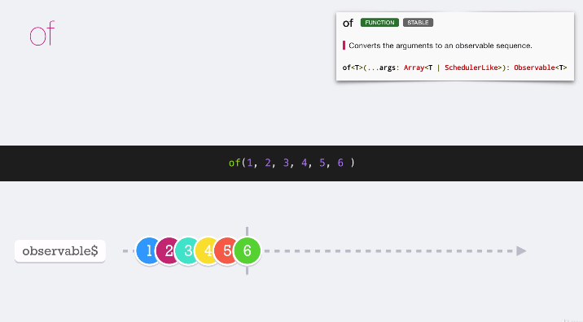
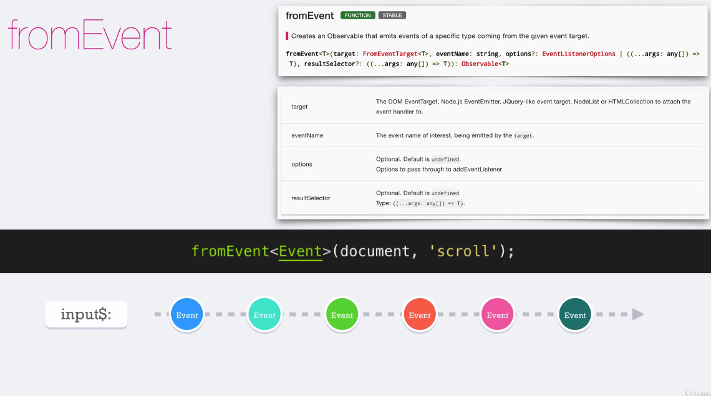
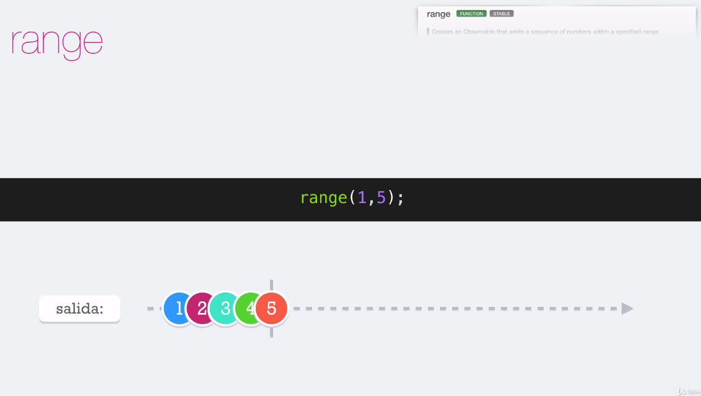
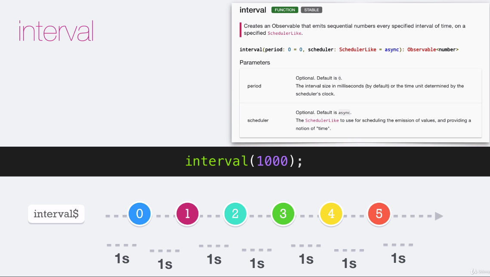
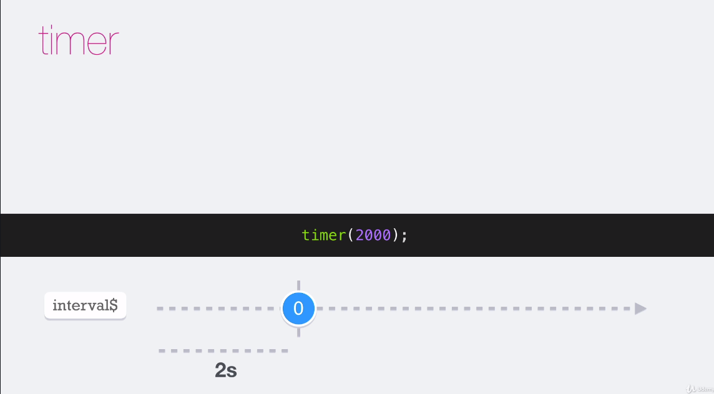

## **Sección 4: Funciones para crear Observables**

## Tabla de contenidos
- [Sección 4: Funciones para crear Observables](#seccin-4-funciones-para-crear-observables)
- [Tabla de contenidos](#tabla-de-contenidos)
    - [22. Temas puntuales de la sección](#22-temas-puntuales-de-la-seccin)
    - [23. Of](#23-of)


##22. Temas puntuales de la sección

Es momento de utilizar funciones para crear observables!, esto nos ayudará a reducir mucho el tiempo a la hora de crear nuevos observables.

Los temas principales de la sección son:

* of
* fromEvent
* interval
* timer
* asyncScheduler

Mas adelante veremos otras funciones que crean observables, pero por ahora enfoquemos nuestra atención en las básicas y más comunes.

## 23. Of

**of:** cuando tengamos una secuencia de valores que siempre van a ser boléanos o siempre van a ser strings,
es recomendable agregar el tipo de dato of<string> o of<number>, con el objetivo de tener un tipado estricto de datos


```javascript
 const obs$ = of ( [ 1,2 ], { a:1, b:2 },  function(){}, Promise.resolve( true )) 
```



## 24 FromEvent

**fromEvent:** nos permite crear observables de even target es decir de cierto tipo
en este ejemplo el event target es el DOCUMENT donde se busca todos los eventos del SCROLL



## 25. Range

**range:** la cual nos crea un observable, que crea una secuencia de números en base a un rango, 
por defecto con síncronos pero se puede transformar en asincronos con la función **async scheduler**, si tenemos un range de 1 - 5 el valor inicial será 1 y el último será va ser el 5 y se completaría
interval, el segundo parámetro del range indica el N número consecutivos 




```javascript

import {asyncScheduler, range} from "rxjs";
//const src$ = of(1,2,3,4,5);
// por defacto el range es sincrona
// asyncScheduler funciona de manera asincrona
// valor por defector del inicio = 0
const src$ = range(1,5, asyncScheduler);

console.log('inicio');
src$.subscribe(console.log);
console.log('fin');

```

```javascript
range( 1,5 )
 outPut
 1
 2
 3
 4
 5

 range(-5,5)
outPut
 -5
 -4
 -3
 -2
 -1
```

## 26 - 27. Interval y timer


**interval y timer:** estas dos funciones trabajan con intervalos de tiempo

* interval: genera una secuencia de números de 0 hasta infinito, por naturaleza con asíncronos


 

* timer: genera un observable que empieza a emitir valores después de una fecha específica después de ese valor empieza a generar los valores siguientes en un periodo de tiempo indicado 

 


## 28. AsyncScheduler

**asyncScheduler:** no crea un observable crea una subscrpcion, (una subscripción es el producto de un .subcribe()  )transforma de sincrona a asincrona

## 29. Ejemplos de from y of

**from:** crea un observable con base en un array, objeto, promesa, iterable, otro observable
