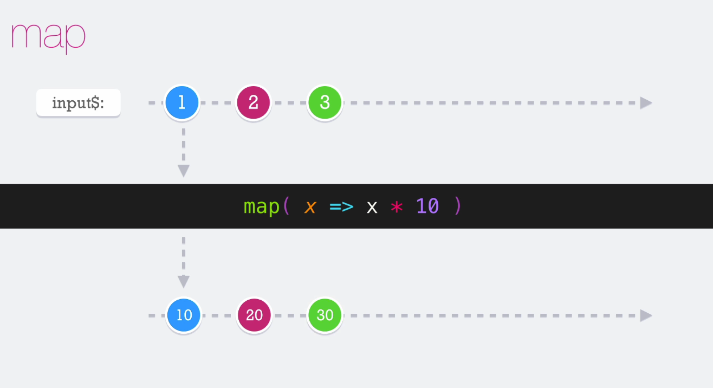
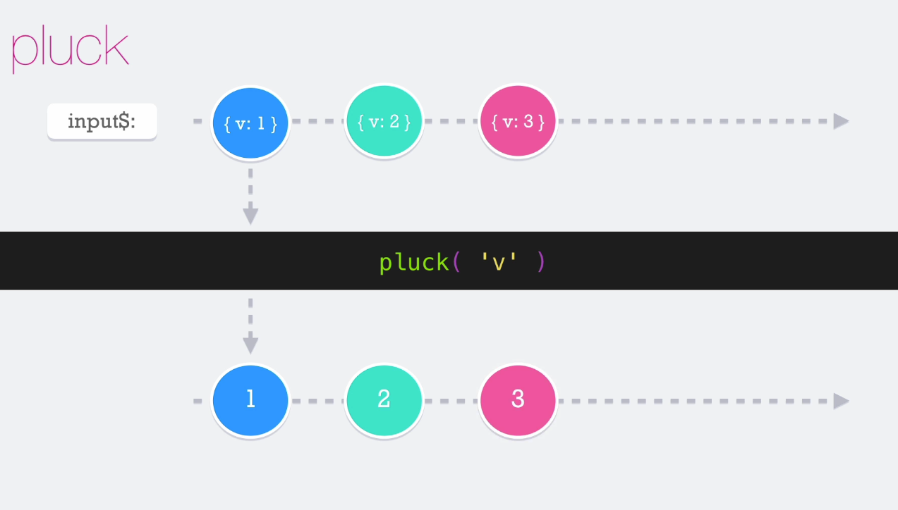
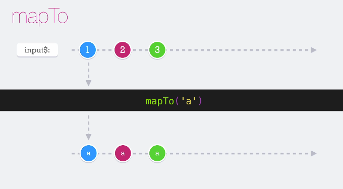
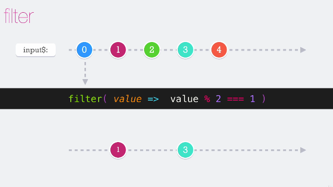
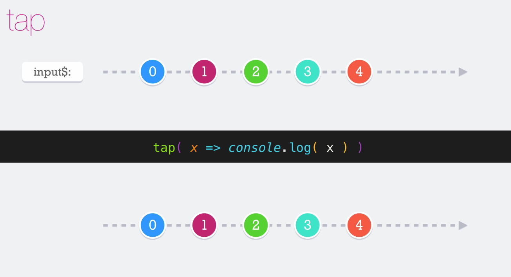
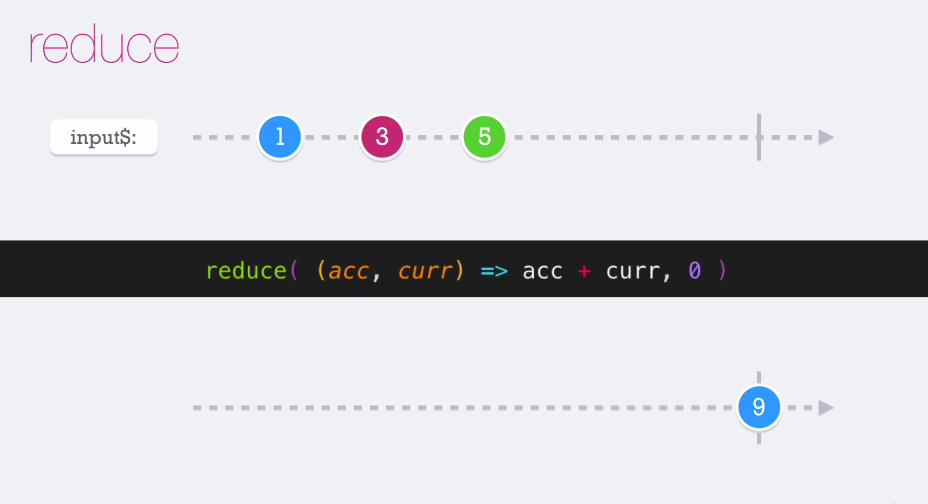
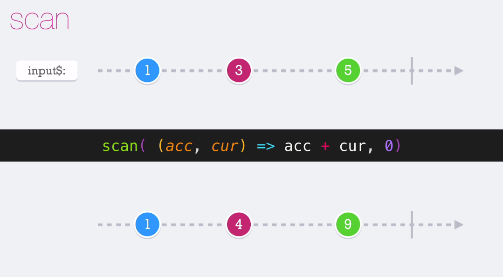

## **Sección 5: Operadores básicos**

## Tabla de contenidos
- [Sección 5: Operadores básicos](#seccin-5-operadores-bsicos)
- [Tabla de contenidos](#tabla-de-contenidos)
    - [31. Introducción](#31-introduccin)
    - [32. Temas puntuales de la sección](#32-temas-puntuales-de-la-seccin)

## 31. Introducción

Operadores: 
* 1. por ejemplo cuando se conecta a una manguera a una toma de agua (stream de información), toda el agua fluye atravez de la maguera
* 2. cuando se le conecta un aspersor de agua, algo que cambia el flujo y sale otro tipo de chorro
    
Esa sería una analogía a operador, nos permite conectar una pieza al flujo de información y esa pieza hace algo en particular 

Es momento de entrar al tema de los operadores. Este tema me encanta y es donde ReactiveX brilla, porque la fuerza de los operadores nos permiten jugar con la data y el flujo de información de una manera sorprendente.

## 32. Temas puntuales de la sección
Los temas principales de esta sección son:

Explicación de los operadores

Operadores como:

* map
* pluck
* mapTo
* filter
* tap
* reduce
* scan
* Encadenamiento de operadores

Entre otros temas que verás poco a poco... estos son los operadores comunes y más usados...

## 34. Map
Es el más común, permite trasformar lo que recibimos o lo que emite el observable en algo que
nosotros ocupemos, puede servir para extraer inf o para transformarla o retornar otra cosa totalmente diferente

## 35. Plunk

Es útil cuando necesitamos extraer un valor del objeto que estamos recibiendo y que esa sea la nueva salida del observable

## 36. MapTo [documentation](https://rxjs-dev.firebaseapp.com/api/operators/mapTo)

cuando el observable emite el valor **1** y entra al **mapTo** la salida sería **a**, sirve para mostrar una salida específica

## 37. Filter

sirve para filtrar la emisión de los valores del observable

ej: si el número que ingresa es un impar lo deja pasar

## 39. Tap

El principal uso del tap es disparar efectos secundarios como por ejemplo imprimir en consola para conocer el valor que tenemos ó bien cuando se necesite disparar una acción cuando la información pasa por ese observable o cuando sea emitido un nuevo valor en el cual está presente mi tap, **NO CAMBIA EL FLUJO DE INFORMACIÓN**

* tap no modifica la data

## 42. Reduce
Aplica una función acumuladora a las emisiones producidas por el observable

ej:

en este ejemplo se emite 1,3,5 pero no emite nada el reduce **acc** es el valor acumulado el **curr** es el valor actual (current value), dentro del *reduce* dice que va retornar el valor acumulado más el valor actual, el **cero** indica el valor inicial.
Cuando el observable se completa entonces ahí es cuando vamos a tener el total acumulado

##  43. scan

El operador scan es casi lo mismo al **reduce** pero con una diferencia, cuando los valores son emitidos por el observable inmediatamente van saliendo con forme van ingresando pero REGRESA su valor acumulado

