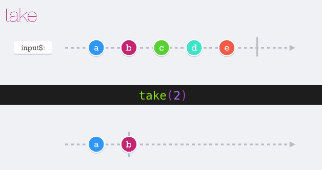
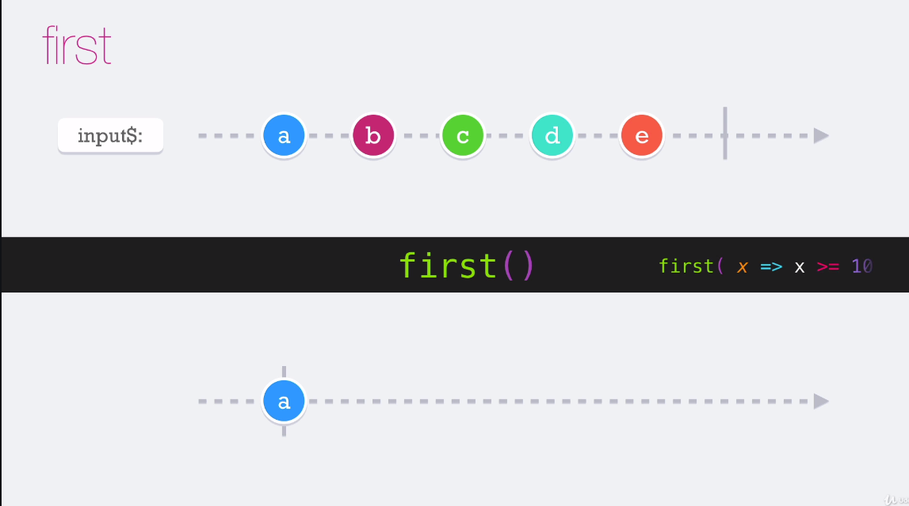
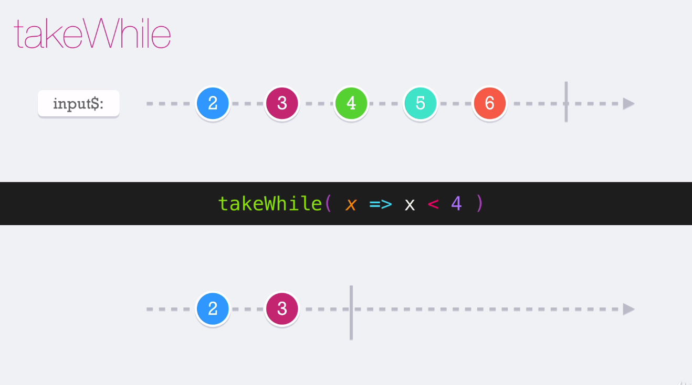
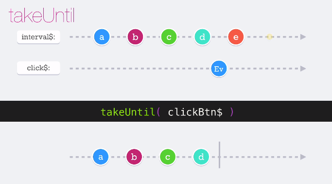
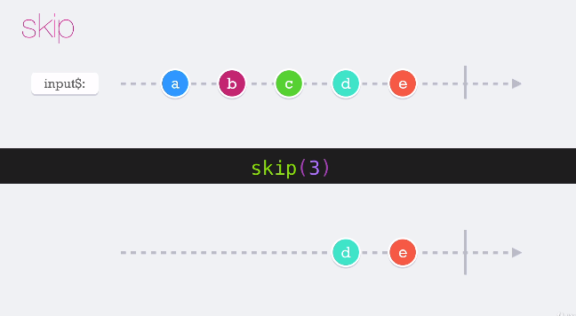
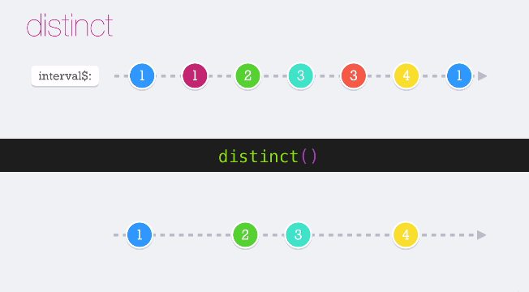
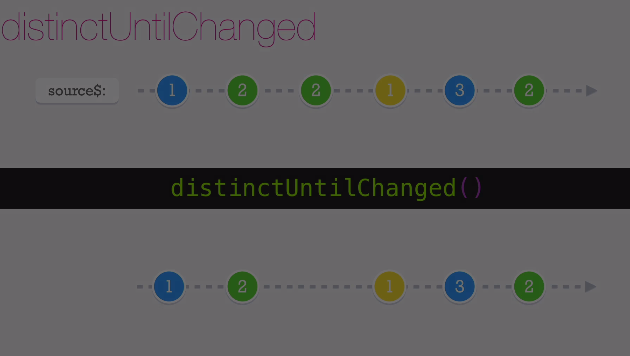

## **Sección 6: Operadores no tan comunes**

## Tabla de contenidos
- [Sección 6: Operadores no tan comunes](#seccin-6-operadores-no-tan-comunes)
- [Tabla de contenidos](#tabla-de-contenidos)
    - [46. Temas puntuales de la sección](#)


## 46. Temas puntuales de la sección

Operadores no tan comunes, aunque este término es relativo porque sé que muchos de ustedes usan estos operadores todos los días, quiero agruparlos como la segunda categoría de operadores para aprender.

Los temas principales son los siguientes operadores:

* take
* first
* takeWhile
* takeUntil
* skip
* distinct
* distinctUntilChanged
* distinctUntilKeyChanged

## 47. Take

Toma el número de iteraciones de un observable que se le indique




## 48. First

Cuando el observable emite el primer valor con first() solo toma el primer valor y finaliza
otra condicion que se le puede poner es que ```` first(x => x>+10) ````



## 49. TakeWhile

Permite recibir valores mientras la condición se cumpla

Pero en el caso que se desee imprimir el valor que rompe la condición se utiliza INCLISIVE (el ultimo valor con el que se realizo la validacion)

Cuando la condición sea mayor o igual 4 no imprime




## 50. TakeUntil

Es un observador que recibe como parámetro otro observable.

Sigue recibiendo y emitiendo los valores del primer observable hasta que el segundo observable emita su primer valor



## 51. Skip
Sirve para emitir x cantidad de emisiones iniciales



## 52. Distinct

Deja pasar valores que no hayan sido emitidos previamente en mi observable




## 53. Distinct until change
Es muy parecido al operador **distinct**, la diferencia es que emite valores siempre y cuando la emisión anterior no sea la misma



## 54. DistinctUntilKeyChanged
funciona igual al DistinctUntilChange, solo que el DistinctUntilKeyChanged recibe como parámetro un string que es la clave  un objeto de tipo clave:valor


